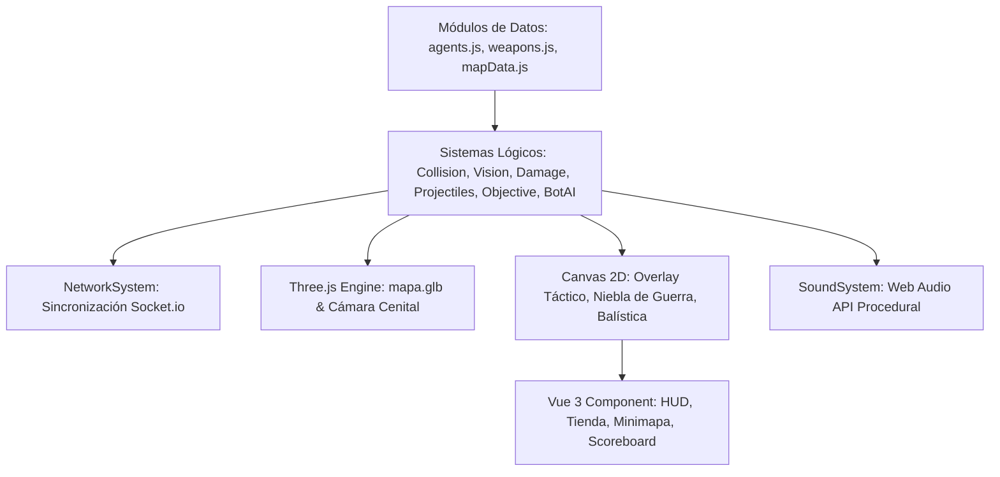

# Arquitectura del Sistema — Valoran3D 2.0

## 1. Visión General
Valoran3D 2.0 está estructurado siguiendo el principio de separación entre **Datos**, **Lógica de Sistemas** y **Representación Gráfica**.

## 2. Módulos y Sistemas
- `CollisionSystem`: Resuelve el movimiento del jugador con deslizamiento en paredes (sliding), detección de colisión de proyectiles con rebotes reflectivos y raycasting de visión.
- `VisionSystem`: Calcula el polígono de visibilidad del jugador, aplica oclusión por obstáculos y esferas de humo, y gestiona la visión compartida de equipo.
- `ProjectileSystem`: Administra balas trazadoras, flechas sónicas con rebotes, canisters incendiarios y proyectiles de habilidades.
- `AreaEffectSystem`: Controla humos orbitales/rápidos, zonas de daño por fuego, campos de ralentización y pulsos de radar.
- `DeployableSystem`: Gestiona entidades físicas colocadas en el mapa (Muros de jade con salud individual, torretas automáticas, anclas de teletransporte y orbes de almas).
- `DamageSystem`: Aplica multiplicadores de daño (Cabeza/Cuerpo/Pierna), absorción del 66% por blindaje y estados de vulnerabilidad o invulnerabilidad.
- `ObjectiveSystem`: Controla el ciclo de vida del artefacto Spike (recogida, plantado de 4s, desactivación de 7s con punto medio a 3.5s, detonación expansiva).
- `BotAISystem`: Inteligencia artificial táctica para partidas locales y campo de práctica con navegación, toma de ángulos, disparo en ráfaga y uso de habilidades.
- `NetworkSystem`: Conexión cliente-servidor para salas privadas, sincronización en tiempo real e interpolación.
