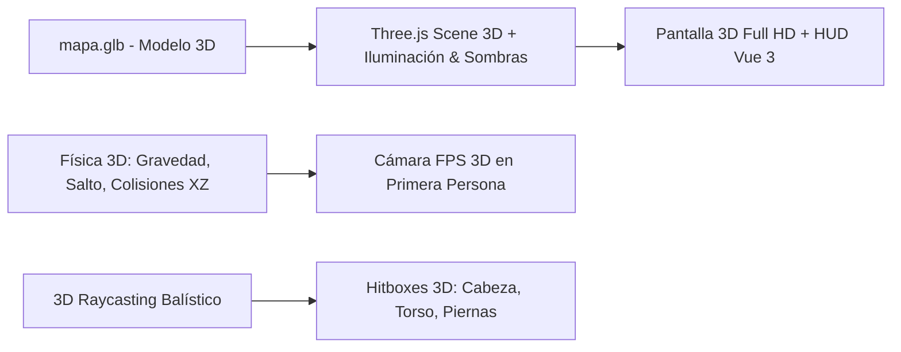

# Mapa 3D y Física Espacial — Valoran3D 2.0

## 1. Integración con `mapa.glb`
El modelo tridimensional `public/models/mapa.glb` es renderizado en Three.js con sombras suaves (PCFSoftShadowMap), iluminación hemisférica y sombras direccionales.

## 2. Zonas Tácticas 3D
- **Spawn Atacantes:** `(X: -24, Y: 1.7, Z: 0)`
- **Spawn Defensores:** `(X: 24, Y: 1.7, Z: 0)`
- **Site A:** Holograma de zona en `(X: 14, Y: 0, Z: -14, Radio: 7.5m)`
- **Site B:** Holograma de zona en `(X: 14, Y: 0, Z: 14, Radio: 7.5m)`
- **Spike 3D:** Entidad 3D con luz LED roja, canalización de plantado y detonación expansiva.

